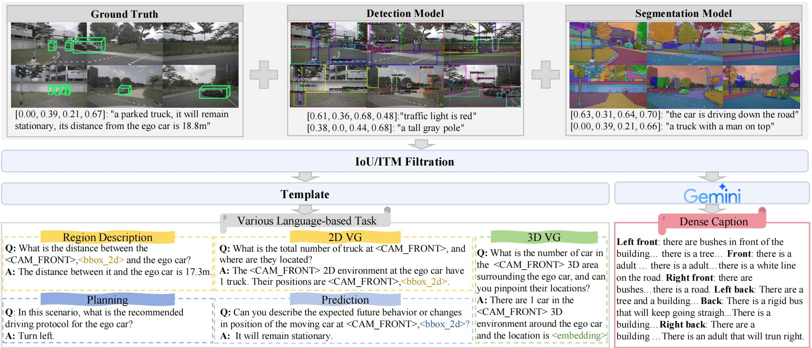

<div align="center">
<h3>Extending Large Vision-Language Model for <br>Diverse Interactive Tasks in Autonomous Driving</h3>

Zongchuang Zhao<sup>1\*</sup>, Haoyu Fu<sup>1\*</sup>, Dingkang Liang<sup>1†</sup>, Xin Zhou<sup>1</sup>, Dingyuan Zhang<sup>1</sup>, Hongwei Xie<sup>2</sup>,  Bing Wang<sup>2</sup>, Xiang Bai<sup>1</sup>

<sup>1</sup>  Huazhong University of Science & Technology, <sup>2</sup>  Xiaomi EV 

(\*) Equal contribution. (†) Project leader.

<a href="https://arxiv.org/abs/2505.08725"></a>
<a href="https://github.com/zc-zhao/DriveMonkey"></a>
</div>

# DriveMonkey

## NuInteract Dataset
NuInteract is constructed based on [nuScene](https://github.com/nutonomy/nuscenes-devkit). It encompasses 239K images (six single-view images and one surrounding view image for each frame) with high-quality dense captions and 1.3M data across diverse interactive language-based tasks, resulting a total of 1.5M image-text pairs.

<div align="center">

</div>

### Dense Caption

We collect various objects and their information from different experts, including the Ground Truth of [nuScene](https://github.com/nutonomy/nuscenes-devkit), [GRiT](https://github.com/JialianW/GRiT) for extracting bounding boxes and corresponding object descriptions, and [SAM](https://github.com/facebookresearch/segment-anything) segmenting and identifying objects followed by describing them using [BLIP](https://github.com/facebookresearch/segment-anything). We then filter them using Intersection over Union (IoU) and Image-Text Matching (ITM) criteria. The filtered objects and the corresponding information are then input into the [Gemini](https://ai.google.dev/gemini-api/) to generate dense captions.

1. Please download the dense caption of NuInteract dataset [cap_public.tar.gz](https://github.com/zc-zhao/DriveMonkey/releases/download/NuInteract_Dataset/cap_public.tar.gz) and decompress it.

```
tar -zxvf cap_public.tar.gz
```
After decompressing it, the file tree is as follows:
```
all_caption_public/
├── 0a0d1f7700da446580874d7d1e9fce51.json
├── 0a1b4e0aa3824b0a96bafae7105c58cc.json
├── ...
├── token_name.json
└── fffce4445c964803a12a2d64023fde40.json
```

2. Use the scripts [load_dense_caption.py](tools/load_dense_caption.py) to load dense caption and convert the dense caption to [InternVL](https://github.com/OpenGVLab/InternVL) data format. Note that set the file path to your own.
```
python load_dense_caption.py
```

### Other Diverse Tasks
We use predefined templates combined with object information to create data for diverse interactive driving tasks, including 2D region description, 2D visual grounding, prediction, planning, and 3D visual grounding.

Please download the dataset [NuInteract.zip](https://github.com/zc-zhao/DriveMonkey/releases/download/NuInteract_Dataset/NuInteract.zip) and decompress it.
```
unzip NuInteract.zip
```
After decompressing it, the file tree is as follows:
```
NuInteract/
├── train/
│ ├── 2D Visual Grounding.pkl
│ ├── Region Description and Prediction.pkl
│ ├── planning.pkl
│ └── 3D Visual Grounding.pkl
├── test/
│ ├── 2D Region Description Prediction and Visual Grounding.pkl
│ ├── planning_test.pkl
│ └── 3D Visual Grounding.pkl
```
All files follow the conversation format of [InternVL](https://github.com/OpenGVLab/InternVL).


## TODO
- [ ] DriveMonkey Framework
- [ ] DriveMonkey Checkpoint

## Acknowledgement

This project is based on InternVL ([code](https://github.com/OpenGVLab/InternVL)), nuScene ([homepage](https://www.nuscenes.org/), [code](https://github.com/nutonomy/nuscenes-devkit)). Thanks for their wonderful works.

## Citation
If this work is helpful for your research, please consider citing:

```
@article{zhao2025extending,
  title={Extending Large Vision-Language Model for Diverse Interactive Tasks in Autonomous Driving},
  author={Zhao, Zongchuang and Fu, Haoyu and Liang, Dingkang and Zhou, Xin and Zhang, Dingyuan and Xie, Hongwei and Wang, Bing and Bai, Xiang},
  journal={arXiv preprint arXiv:2505.08725},
  year={2025}
}
```
